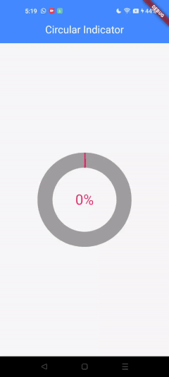

# Circular Indicator Rendering Using CPU and GPU

What if the CPU took the wheel? That question haunted me. So, I set out to build a circular indicator from the ground up—calculating every point manually on the CPU, then handing it off to the GPU for rendering alone. No shortcuts. No crutches. Just raw computation. Could modern mobile CPUs survive the storm of geometry under pressure? This wasn’t just an experiment—it was a challenge to the status quo, a test of limits, and a deep dive into the untold performance gap between the CPU and GPU. My mission? Strip the GPU of all computation duties and still achieve buttery-smooth performance.

## The Challenge

The main challenge was maintaining performance while handling thousands, hundreds of thousands, or even millions of points—depending on the UI or screen. Optimization was key.

## Environment

The project is implemented with:

- **Flutter SDK**: 3.27.4
- **Dart SDK**: 3.6.2
- **Channel**: Stable

## Let’s Get Started

I divided the project into multiple stages:

### Stage 1: Building the Circular Background

The first step was to build the circular background and use its points for animation. I know sine and cosine functions represent a circle, so I used them to build the background. However, they are computationally expensive. To optimize, I estimated only one-quarter of the circle—the fourth quarter—and reflected it to get the other three. This allowed me to avoid repeated sin and cos calculations.

```dart
for (double currentAngle = 0; currentAngle < 90; currentAngle += _rotationAngle) {
  Offset offset = Offset(
    cos(currentAngle * pi / 180) * radius,
    sin(currentAngle * pi / 180) * radius,
  );
}
```

Here’s how `_rotationAngle` is calculated:

```dart
_rotationAngle = 360 / (radius * 2 * pi);
```
Which is the minimum step to rotate

### Stage 2: Reconstructing the Full Circle

- **Third Quarter**: Mirror the fourth quarter across the X-axis.
- **Second Quarter**: Take the normal vector from the fourth quarter point, multiply it by -radius.
- **First Quarter**: Mirror the third quarter across the X-axis and Y-axis using a similar approach.

```dart
Offset normal = getNormalVectorOfPoint(offset);

Offset thirdHalfOffset = offset.translate(-offset.dx * 2, 0);
Offset secondHalfOffset = -normal * radius;
Offset firstHalfOffset = -getNormalVectorOfPoint(thirdHalfOffset) * radius;
```

### Adding Stroke Width

Initially, each point has a stroke width of 1. We expand this using normal vectors to simulate thicker lines:

```dart
List<double> addStrokeWidth(Offset normal, bool reverse) {
  List<double> offsetList = [];
  for (double i = 1; i <= strokeWidth; i++) {
    double strokeWidthPoint = radius - i;
    Offset offset = Offset(normal.dx * strokeWidthPoint, normal.dy * strokeWidthPoint);
    if (reverse) {
      offsetList.add(offset.dy);
      offsetList.add(offset.dx);
    } else {
      offsetList.add(offset.dx);
      offsetList.add(offset.dy);
    }
  }
  return offsetList;
}
```

### Combining All Quarters

Instead of using one list, I used separate lists for each quarter. This allows reordering before combining them, so that the final list starts from angle 0 and ends at angle 360—important for correct animation sequencing.

```dart
allPointsListFloat = Float32List.fromList([
  ...firstQuarterPoints.reversed,
  ...fourthQuarterPoints,
  ...thirdQuarterPoints.reversed,
  ...secondQuarterPoints
]);
```

I used `Float32List` for compatibility with `canvas.drawRawPoints`, which is more efficient than `canvas.drawPoints`.

### Rendering and Animation

Once points are estimated, they’re passed to a custom painter to render the circular indicator background. Then the animation starts. To animate, we slice the point list each frame and send that slice to the custom painter.

```dart
void update(Size size) async {
  if (isPainted) {
    isPainted = false;
    if (endPointsPerFrame < widget.offsetListFloat.length) {
      final totalLength = widget.offsetListFloat.length;
      final step = totalLength / (60 * widget.animationTime);
      startPointsPerFrame = endPointsPerFrame;
      endPointsPerFrame += step;
      if(endPointsPerFrame > widget.offsetListFloat.length)
        endPointsPerFrame = widget.offsetListFloat.length.toDouble();
      if ((startPointsPerFrame.toInt() ^ endPointsPerFrame.toInt()) & 1 != 0) {
        endPointsPerFrame -= 1;
      }
    }
    await saveCanvasToImage(size);
  }
}
```

Using only `endPointsPerFrame` slices from the start of the list up to that index. Each frame draws more points.

### But There Is A Problem With This

Flutter clears the canvas each frame if should repaint is true. If you don’t save previous content, you're forced to redraw all previous and new points each time, which slows performance.
When using Flutter to draw a large number of points each frame, performance issues arise due to both CPU-GPU communication overhead and the inefficiency of drawing individual points. Here's the core reasoning:
CPU to GPU Communication: Sending a large number of points from the CPU to the GPU creates an overhead, especially if it happens every frame.
GPU's Optimized Spatial Rendering: The GPU works most efficiently when rendering larger shapes (e.g., rectangles or triangles) rather than individual points. Processing each point separately increases the GPU's workload.
DrawRawPoints Inefficiency: Methods like drawRawPoints() treat each point independently, which results in high overhead, especially for large sets of points.

## The Solution

- Use `AnimatedBuilder` to control frame drawing.
- Save previous canvas content as an image and reuse it.
There are other methods to optimize, but they do not align with my goal, which is to send raw points and draw them

```dart
Future<void> saveCanvasToImage(Size size) async {
  final recorder = ui.PictureRecorder();
  final canvas = Canvas(recorder);
  
  PaintIndicator(
    widget.offsetListFloat!.sublist(startPointsPerFrame.toInt(), endPointsPerFrame.toInt()),
    savedImage,
    indicatorColor: widget.indicatorColor,
  ).paint(canvas, size);

  final picture = recorder.endRecording();
  savedImage = await picture.toImage(size.width.toInt(), size.height.toInt());
  isPainted = true;
}
```

## Result

I successfully achieved smooth animation for the circular indicator! (Note: The preview is a GIF, so it may not appear smooth due to the format’s limitations.)



This was tested on the Qualcomm Snapdragon 865 (considered a high-end processor in 2020) and the MediaTek Helio G80 (considered a mid-range processor in 2020), and both ran smoothly at 60 fps.
## Considerations

1. **Aliasing at the Edges**
   - The circular indicator has slight aliasing artifacts at the edges because it is rendered as an image.
   - This visual issue is minor but noticeable on high-resolution displays.

2. **Stroke Width and Performance**
   - Increasing the stroke width significantly raises the number of points drawn.
   - This can impact performance, especially on low-end devices.

3. **Frame Rate Handling**
   - The animation updates at a fixed 60 FPS.
   - I did not use a package to fetch the actual device frame rate dynamically.

4. **Dropped Frames and Timing**
   - Rarely, some frames are dropped, which causes small gaps in the circular drawing.
   - To ensure the circle is fully drawn:
     - Dropped frames are repeated to avoid visual gaps.
     - As a result, the total animation time equals: expected animation duration + time to repeat dropped frames.
   - This workaround helps maintain the visual completeness of the animation, though it may slightly affect timing precision.

   In the end the CPU only takes the half of the wheel. This gap is gonna be small in the future due to the development of CPUs. In the era of quantum computing we may not need GPUs.
## Why Do We Even Have a GPU?

We all know the answer: the GPU complements the CPU by handling tasks the CPU isn't optimized for. I was shocked by the poor performance before I made the optimization. When using the custom painter canvas to draw a circular indicator with animation, the canvas not saving the previous drawing so each frame the canvas clears its content and starts drawing again. That’s ok if we use canvas methods which are estimating the point in the GPU, as the estimation on the GPU is very fast because of parallel processing. In the CPU, we send the points to the canvas, and the canvas uses `drawPoint` or `drawRawPoint`, which are not optimal for drawing a large number of points, even on the GPU because the GPU draws each point one by one, and the mechanics that the GPU follows to draw is different and makes it slower.

## Conclusion

GPUs are hundreds of times more efficient than CPUs for tasks like rendering because they use parallel processing and are designed to handle massive data like millions of pixels.

Using the CPU to estimate UI points makes sense only if:
- The number of points is small.
- GPU is unavailable or not ideal for the task.

